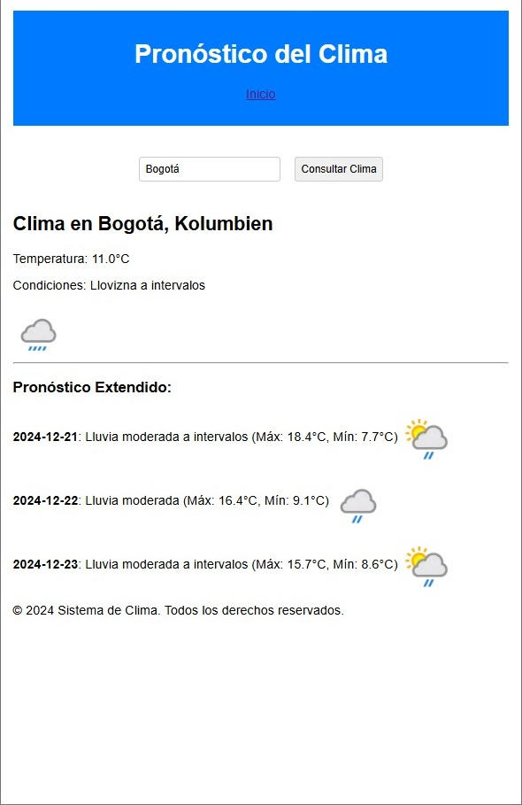
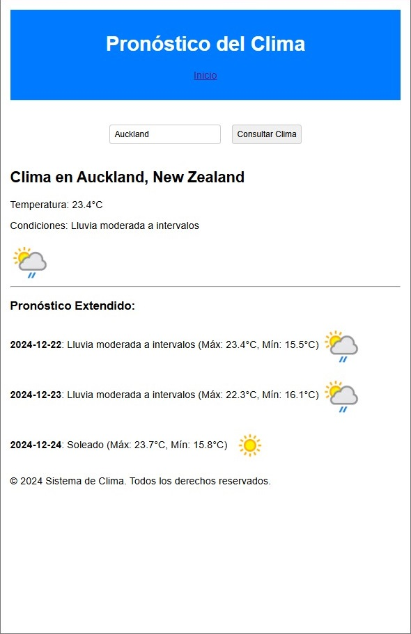

# *Estado del Clima* 🌤️

Este proyecto combina **FastAPI** y **Django** para ofrecer una solución web completa que permite a los usuarios
consultar información climática de manera rápida y sencilla. **Django** maneja el frontend y **FastAPI** proporciona
datos meteorológicos a través de una API integrada con WeatherAPI. Este sistema permite obtener el clima actual y un
pronóstico de 3 días con detalles como temperatura, humedad, probabilidad de lluvia, y mucho más. Su diseño responsivo
asegura una experiencia óptima en PC y dispositivos móviles.

## *Requisitos*

-   Python 3.9 o superior
-   FastAPI
-   Uvicorn
-   Python-dotenv
-   Requests
-   Django
-   Clave de API de WeatherAPI

## *Uso*

Ingresa el nombre de una ciudad en el cuadro de texto en la página principal y presiona "Consultar Clima".
Verás el clima actual y el pronóstico para los próximos 3 días.

## *Estructura del Proyecto*

04_Estado_del_clima/
├── app/                              # FastAPI (Backend)  
│   ├── __init__.py  
│   ├── main.py                       # Lógica principal de FastAPI  
├── web/                              # Django (Frontend)  
│   ├── web/                          # Configuración principal de Django  
│   │   ├── settings.py  
│   │   ├── urls.py                   # Rutas del proyecto Django  
│   ├── clima/                        # Aplicación Django  
│   │   ├── views.py                  # Lógica de las vistas  
│   │   ├── urls.py                   # Rutas específicas de la app  
│   │   ├── static/                   # Archivos estáticos (CSS, JS)  
│   │   │   └── css/  
│   │   │       └── styles.css  
│   ├── templates/                    # Plantillas HTML  
│   │   ├── base.html  
│   │   └── index.html  
├── requirements.txt                  # Dependencias del proyecto  
├── .env                              # Configuración de variables de entorno  

## *Mejoras Futuras*
1. *Pronósticos Extendidos*: Agregar más días al pronóstico y gráficos interactivos para mostrar tendencias climáticas.
2. *Favoritos*: Permitir a los usuarios guardar ciudades para consultas rápidas y acceder fácilmente a su clima.
3. *Integración con Mapas*: Mostrar el clima en un mapa interactivo para las ciudades seleccionadas, utilizando APIs como Google Maps.
4. *Interfaz Avanzada*: Incorporar un diseño más dinámico.
5. *Datos Avanzados*: Incluir información como la calidad del aire, niveles de polen y condiciones de visibilidad.

## *Capturas de pantalla*

